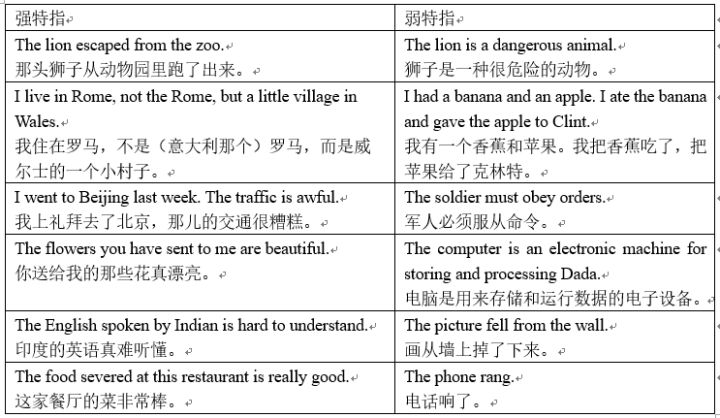
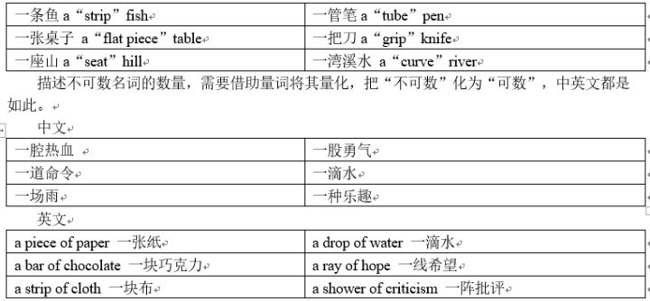

# 词性/词类i

传统语法书将词分为十大类：即名词（noun）、代词（pronoun）、形容词（adjective）、副词（adverb）、动词（verb）、数词（numeral）、冠词（article）、介词（preposition）、连词（conjunctions）和感叹词（interjection）。

这十种词还可以分为三大类:

1. 非语法重点：代词、数词、感叹词
2. 四大实词：名词、动词、形容词、副词
3. 三大虚词：介词、连词、冠词

**所谓&quot;实词&quot;，是指可以单独在句子中作成分的词。** 四种重要的实词还可以进一步划分为核心实词和修饰性实词，核心实词包括名词和动词（分别构成主语与谓语），修饰性实词包括形容词和副词
 

**所谓&quot;虚词&quot;，是指不能单独做句子成分的词。** 介词需要和名词一起出现，连词需要连接两个词语、短语或者句子，冠词需要和名词一起出现。虚词是英语组合语句的重要方式之一。

# 冠词ii

冠词与名词一起出现，起着修饰限定名词的作用。

冠词是英语词类中最小的一类，只有三个，即不定冠词（Indefinite Article）a和an，以及定冠词（Definite Article）the。此外也有些特定场合不用冠词，通常称为零冠词（Zero Article）。

旋元佑先生在《语法俱乐部》中对冠词进行了如下简化：

1.把a(n)视为one的弱化结果，也就是说，a(n)就代表one的意思，只是语气比较弱。a(n)与one同样都是交代它后面所接的名词是&quot;一个&quot;的概念。如果后面的名词不适合以&quot;一个&quot;来交代，就不适合用a(n)。

2.把the视为that或those的弱化结果。that或those是指示形容词，有明确的指示功能。所以定冠词the也可以这样理解：凡是上下文中有明指或暗示时，也就是有&quot;那个&quot;的指示功能时，便要用定冠词the。

这种简化能在一定程度上帮助理解冠词，但仅仅掌握这些是不够的。冠词的背后是中英文思维方式的不同。冠词的难点在于，学习者同时受到母语正迁移与负迁移的影响。

**一、冠词背后的英语思维与用法概述**

冠词的本质是限定词的一类。为了表意精确，英语句子中出现的名词通常都需要进行一定程

度的限定，而汉语没有类似规则。限定通常体现在两方面:指向和数量，且指向和数量至少有一方面需要被限定。

 

学习完本章，读者朋友就能够明白，为什么下面三句中文对应的是同一句英文：

|  |  | 
| -------- | -----: | 
|   我是演员    | I am an actor |
|    我是个演员  |  |
|    我是一个演员 | |

冠词用法概述

 

**二、关于冠词具体用法的几点说明**

1.可数名词单数

可数名词单数通常需要限定。

 

|  |  |   |
| -------- | :-----: | -----: | 
|   An ear is an organ for listening     | The ear is an organ for listening | Ears are organs for listening   耳朵是听觉器官|
| A computer is an electronic machine for storing and processing data. | The computer is an electronic machine for storing and processing data.  | Computers are electronic machines for storing and processing data.   电脑是用来存储和运行数据的电子设备 |
| A soldier must obey order. | The soldier must obey order.  |  Soldiers must obey order.   军人必须服从命令|

2. 专有名词、不可数名词、可数名词复数与定冠词the

专有名词、不可数名词、可数名词复数已被限定，可以单独出现，只有在需要强烈指示的情况下才需要使用冠词the限定。

 

注意，the+名词复数具有强烈指示作用，因此类似以下的句子是错误的：

The Computers have
revolutionized publishing. （指明了是哪些电脑）

正确的表达方式是：

The Computer has revolutionized
publishing.或者：

Computers have revolutionized
publishing.

3.&quot;a/an&quot;与&quot;一&quot;

英语的不定冠词&quot;a/an&quot;与汉语的&quot;一&quot;表面相似，实则侧重不同。a/an主要起泛指作用，兼职表数量（但不强调数量）；&quot;一&quot;主要作用是强调数量，兼职表泛指。

 

4&quot;the&quot;与&quot;那/那个&quot;

英语的定冠词&quot;the&quot;比汉语&quot;那/那个&quot;的用法广泛。根据指示强度的不同，定冠词the的用法可以分为强特指和弱特指，强特指通常翻译成&quot;那/那个…&quot;（如有其它更具体的限定词则不译），弱特指通常纯粹起限定作用，没有对应的汉语，通常不译。

 

当然，强弱只是相对，译法也只是参考。在谈到对美式英语的看法时，英国女王伊丽莎白二世曾霸气的回答道：

There is no such
thing as &quot;American English&quot;. There is the English language and there are
mistakes.

根本没有什么美式英语。只有&quot;英语&quot;和错误。

这里的the指示很强烈，但无需翻译出指示的含义。

5.一个名词通常不能同时具有两个指向词

英语中指向词通常只有一个，例如：

This is my wife.

这是我的妻子

John&#39;s book is over there.

约翰的书在那。

Neither accusation is true.

两项指控都不成立。

尽管汉语可以说&quot;我的这本书&quot;，但在英语中不能说my the book(指向重复)，&quot;我的一本书&quot;也不能说成my a book（指向矛盾），这点需要特别注意。

6.专有名词与冠词

(1)专有名词与定冠词the

专有名词到底加不加the令很多学习者感到困惑。专有名词可以更进一步分为三种：1.纯粹专有名词，2.纯粹普通名词构成的专有名词，3.半专有半普通名词构成的专有名词。（本小节讨论非强烈特指情况。）

 

(2)非唯一性专有名词冠词

有些专有名词具有非唯一性，其和冠词的搭配比较灵活，例如：

 

7.场所名词与冠词

对于场所类的名词，通常不定冠词a/an表达泛指或数量；定冠词the表特指；零冠词表达一种较为抽象的引申含义。

 

8.位于补语位置名词的冠词

职业、身份、职位与头衔等名词出现在补语（表语、宾补）位置时，通常可以省略冠词，出现在其它位置时，通常不省略冠词。这是因为，出现在补语位置的名词已指向主语。

表语位置：

He is the general manager.

他是总经理。

补语位置：

They elected Henry chairman.

他们推选亨利为主席。

宾语位置：

I want to see the President.

我想见总统先生。

9.不规则的冠词用法

除了上述示例外，英文中还有很多冠词用法很难讲出其道理来，需要学习者慢慢积累。

(1)对于cinema，opera以及theater这几个场所，泛指特指都需要加the

I try to go to the cinema at least
once a week.

We usually go to the cinema in New
Street.

(2)听收音机需要加the而看电视不需要

Listen to the radio.

Watch TV.

(3)球类、棋类运动前不加冠词，乐器前需要加the

play
basketball/football/volleyball

play chess

play the guitar/piano

….

10.英语的量词

冠词与量词密切相关，都属于限定词，所以补充量词的知识非常有必要。在中文里，每说到一件东西，没有不想到它的形状的，但是，英语就好像是不辨形状的一种民族的语言似的。

对于可数名词的数与量，英文比中文要简单得多，通通用a/an解决，不需要管量词，以至于连&quot;a bottom of beer&quot;都懒得说了，直接说&quot;a beer&quot;表示一杯啤酒。但是中文要使用各种不同的量词。

 

至此，冠词全部讲解完毕。在此笔者做一个简单的总结：

1.英语句子中的名词需要限定；

2.已被限定的词视情况加其它限定词

3.注意积累规则之外冠词的用法。

i

#
 https://zhuanlan.zhihu.com/p/21705302

ii

#
 https://zhuanlan.zhihu.com/p/21737918